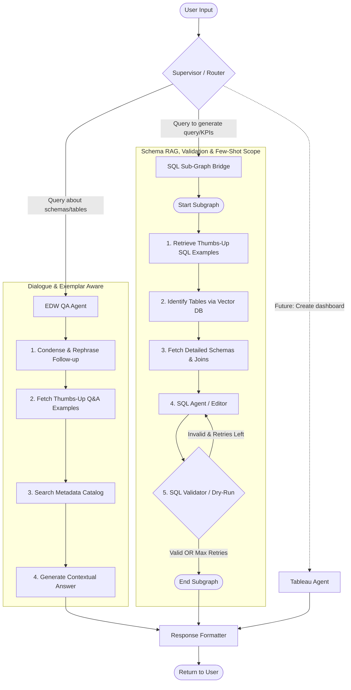
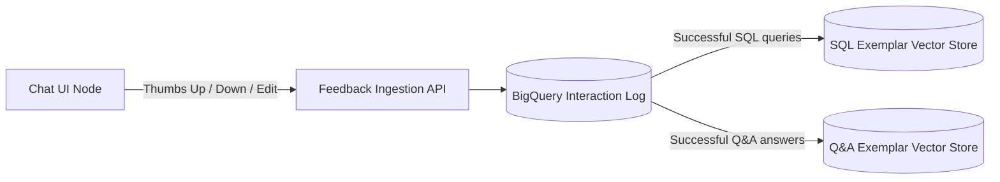

# LangGraph Enterprise Chatbot Architecture Blueprint

This repository contains the detailed system design and architecture blueprint for implementing a multi-agent enterprise chatbot using **LangGraph** and **LangChain** on **Vertex AI**. 

The chatbot routes queries to a **RAG-based Metadata QA Agent** (with query condensation and dynamic few-shot Q&A exemplars) or a **SQL Generator Agent** (which includes a Schema RAG table retrieval step, dynamic few-shot SQL exemplars, and a BigQuery validation dry-run loop for self-correction), with clear hooks to add **Tableau** or **Report Generation** skills in the future.

---

## 1. Graph State & Architecture Overview

The system is modeled as a state machine where nodes represent agents or tools, and edges represent conditional transitions.

---

## 2. Core Components and Workflow Nodes

### Supervisor / Router Node
Acts as the central orchestrator. Using a fast LLM (Gemini 2.0 Flash) and function calling, it classifies incoming queries to route them to the specialized QA or SQL agents.

### EDW QA Agent
Responsible for answering user questions about definitions, schemas, and catalogs.
* **Query Condensation:** Translates conversational follow-up questions (e.g. *"Which columns are in the first one?"*) into standalone search queries.
* **Dynamic QA Few-Shot Exemplars:** Queries a vector store of historically thumbs-up'd answers to find layout/content references, aligning style with user preferences.
* **Metadata Catalog RAG:** Queries the catalog vector index to retrieve matching tables and column metadata.

### SQL Sub-Graph Bridge
Coordinates the private execution context of the SQL generation flow. It isolates compiler error states, retry counts, and dynamic schema variables from the main chat context, preventing context-window bloat.
* **Dynamic Few-Shot SQL Retrieval:** Retrieves the top-matching historical SQL queries from positive feedback logs.
* **Schema RAG (Pruning):** Scans the EDW table descriptions, selects the top $K$ relevant tables, and retrieves detailed DDL schemas and join paths *only* for those tables.
* **Drafter & Self-Correction Validator:** Drafts the query, runs a BigQuery dry-run validation step, catches syntax errors, and feeds them back into the generator for automatic corrections.

---

## 3. How SQL Dry-Run Validation Works Natively on Vertex AI/GCP

When running the SQL agent on Vertex AI, the best practice is to query **BigQuery** using a service account with **Metadata Read-Only** privileges. 

The `QueryJobConfig(dry_run=True)` performs a compile check directly on the BigQuery engine:
* It checks column names, data type mismatches, and syntax errors.
* **It costs $0.00** and does not read any database storage.
* It returns the exact error string, which LangGraph routes back into the SQL Generator's context window for immediate self-correction.

---

## 4. User Feedback Loop Architecture

To support continuous learning, the chatbot UI triggers a feedback event whenever a user submits a Thumbs Up/Down or manually edits a SQL query.

### Feedback Database Schema (BigQuery)
Every message exchange is logged in a telemetry table:
* `thread_id` (STRING): Unique ID of the chat conversation session.
* `message_id` (STRING): Unique ID of the specific message.
* `agent_type` (STRING): `'sql_generator'` or `'metadata_qa'`.
* `user_prompt` (STRING): Original user text.
* `generated_output` (STRING): The SQL query or QA answer drafted by the agent.
* `feedback` (STRING): `'LIKE'`, `'DISLIKE'`, or `NULL`.
* `corrected_output` (STRING): If the user manually edited the query/answer, or a developer corrected it.

### Feedback Ingestion Strategy:
1. **Dynamic Few-Shot Learning (Short Term):** 
   - Cron jobs sync approved pairs to their respective Vector Stores.
   - For SQL queries, the system retrieves and injects working SQL examples.
   - For Q&A, the system retrieves and injects approved answer formatting examples.
2. **Golden Regression Dataset (Medium Term):**
   - Any query marked as `'DISLIKE'` goes to an review queue. A data engineer writes the correct SQL.
   - This correct pair is added to a test suite used in CI/CD pipelines to ensure future prompt adjustments do not regress difficult query patterns.
3. **Model Fine-Tuning (Long Term):**
   - Accumulate these validated query pairs to fine-tune a specialized model (such as Gemini 1.5 Pro) for your specific schema and KPIs.
