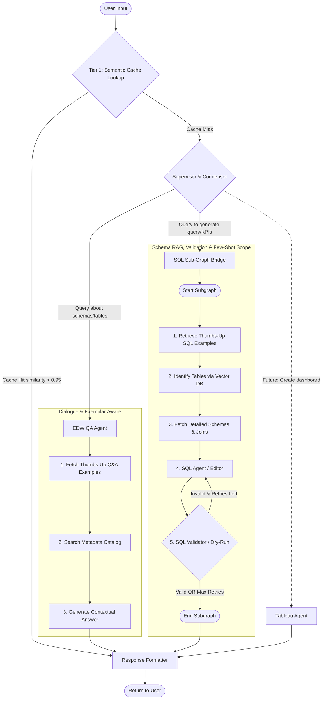
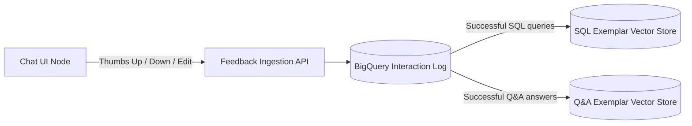

# LangGraph Enterprise Chatbot Architecture Blueprint

This document outlines the detailed architecture and code blueprint for implementing the enterprise chatbot using **LangGraph** and **LangChain** on **Vertex AI**. 

It implements a supervisor agent that routes queries to a **RAG-based Metadata QA Agent** (with query condensation and dynamic few-shot Q&A exemplars) or a **SQL Generator Agent** (which includes a Schema RAG table retrieval step, dynamic few-shot SQL exemplars, and a BigQuery validation dry-run loop for self-correction), with clear hooks to add **Tableau** or **Report Generation** skills in the future.

---

## 1. Graph State & Architecture Overview

The system is modeled as a state machine where the **Supervisor & Condenser** node acts as a unified entry point, routing queries and resolving conversational history in a single step to optimize latency and LLM token usage.



---

## 2. Python Code Blueprint (`chatbot_graph.py`)

Here is the complete blueprint showing how to organize the State, Nodes, and conditional transitions.

<details>
<summary>Click to expand Python Code Blueprint</summary>

```python
from typing import Annotated, Dict, List, Literal, TypedDict
import json
from langchain_google_vertexai import ChatVertexAI
from langchain_core.messages import BaseMessage, HumanMessage, AIMessage
from langgraph.graph import StateGraph, START, END
from langgraph.checkpoint.memory import MemorySaver

# ==========================================
# 1. MAIN GRAPH STATE DEFINITION
# ==========================================
class MainState(TypedDict):
    messages: List[BaseMessage]   # Full conversational dialogue history
    current_agent: str            # Active agent router targets
    resolved_query: str           # Pre-condensed standalone query (resolved pronouns/context)
    cache_hit: bool               # True if Tier 1 semantic cache returned a match
    final_sql: str                # Holds the last successfully verified SQL query
    response_text: str            # Final text output to present to the user

# ==========================================
# 2. PRIVATE SUB-GRAPH STATE DEFINITION (SQL Scope)
# ==========================================
class SQLPrivateState(TypedDict):
    chat_history: List[BaseMessage] # Trimmed message history containing the resolved query
    base_sql: str                   # Previous successful SQL (for follow-up edits)
    few_shot_examples: str          # Dynamically retrieved positive SQL exemplars
    target_tables: List[str]        # Dynamically retrieved relevant tables
    schema_context: str             # DDL and join paths for selected tables only
    sql_query: str                  # Current draft query
    validation_count: int           # Self-correction loop counter
    errors: List[str]               # History of compile errors

# ==========================================
# 3. LLM INITIALIZATION
# ==========================================
model_pro = ChatVertexAI(model_name="gemini-1.5-pro-002", temperature=0.0)
model_flash = ChatVertexAI(model_name="gemini-2.0-flash-exp", temperature=0.2)


# ==========================================
# 4. SQL SUB-GRAPH (SCHEMA RAG + GENERATOR + VALIDATOR)
# ==========================================
sub_workflow = StateGraph(SQLPrivateState)

def fetch_few_shot_exemplars_node(state: SQLPrivateState) -> Dict:
    """
    Feedback Loop Step: Query a vector store of historical successful (Thumbs-Up) queries
    to find similar queries and inject them as few-shot training examples for the generator.
    """
    latest_request = state["chat_history"][-1].content
    
    # In production, look up similarity against a database of verified queries:
    # exemplars = verified_query_vector_store.similarity_search(latest_request, k=2)
    # mock output:
    mock_exemplars = (
        "Example 1:\n"
        "User Request: 'Get sales numbers for regional office in North'\n"
        "SQL: SELECT sum(gross_amount) FROM fct_sales JOIN dim_customers USING(customer_id) WHERE region = 'North'\n"
    )
    return {"few_shot_examples": mock_exemplars}

def identify_tables_node(state: SQLPrivateState) -> Dict:
    """
    RAG Step 1: Query table-description Vector DB using the user's latest request
    to identify relevant tables from our 50+ EDW catalog.
    """
    latest_request = state["chat_history"][-1].content
    
    # Mocking semantic retrieval:
    target_tables = ["fct_sales", "dim_customers"]
    return {"target_tables": target_tables}

def fetch_table_details_node(state: SQLPrivateState) -> Dict:
    """
    RAG Step 2: Fetch detailed schemas (DDL/column specs) and join relationships
    only for the target tables retrieved in Step 1.
    """
    tables = state["target_tables"]
    schema_definitions = []
    
    if "fct_sales" in tables:
        schema_definitions.append(
            "Table fct_sales:\n"
            "  - order_id INT64 (Primary Key)\n"
            "  - customer_id INT64 (Foreign Key to dim_customers)\n"
            "  - gross_amount NUMERIC\n"
            "  - order_date DATE"
        )
    if "dim_customers" in tables:
        schema_definitions.append(
            "Table dim_customers:\n"
            "  - customer_id INT64 (Primary Key)\n"
            "  - name STRING\n"
            "  - region STRING\n"
            "  - signup_date DATE"
        )
        
    join_path_context = "Join path hint: JOIN dim_customers ON fct_sales.customer_id = dim_customers.customer_id"
    full_schema_context = "\n\n".join(schema_definitions) + "\n\n" + join_path_context
    
    return {"schema_context": full_schema_context}

def draft_sql_node(state: SQLPrivateState) -> Dict:
    """
    RAG Step 3: Generates or modifies SQL using pruned schema, feedback exemplars, and memory.
    """
    latest_user_request = state["chat_history"][-1].content
    base_sql = state.get("base_sql", "")
    schema_context = state["schema_context"]
    few_shots = state.get("few_shot_examples", "")
    errors = state.get("errors", [])
    
    retry_context = ""
    if errors:
        retry_context = f"\nYour previous SQL attempt failed validation. Compilation Error: {errors[-1]}. Please rewrite and correct it."
    
    if base_sql:
        prompt = f"""
        You are an expert BigQuery SQL Editor. Modify the base SQL query to fulfill the new request.
        Only return raw SQL code wrapped inside triple backticks. Do not include markdown explanations.
        
        Relevant Schemas:
        {schema_context}
        
        Base SQL Query to modify:
        ```sql
        {base_sql}
        ```
        
        New Modification Request: "{latest_user_request}"
        Chat History Context: {state["chat_history"][:-1]}
        {retry_context}
        """
    else:
        prompt = f"""
        You are an expert BigQuery SQL Developer. Write a SQL query from scratch.
        Only return raw SQL code wrapped inside triple backticks. Do not include markdown explanations.
        
        Here are examples of correct SQL output for similar requests:
        {few_shots}
        
        Relevant Schemas:
        {schema_context}
        
        User Request: "{latest_user_request}"
        Chat History Context: {state["chat_history"][:-1]}
        {retry_context}
        """
        
    response = model_pro.invoke(prompt)
    sql_code = extract_sql_from_markdown(response.content)
    
    return {
        "sql_query": sql_code,
        "validation_count": state.get("validation_count", 0) + 1
    }

def validate_sql_node(state: SQLPrivateState) -> Dict:
    """
    Syntactic Validation: Performs a dry-run check against the warehouse engine.
    """
    sql = state["sql_query"]
    try:
        # Production dry-run implementation:
        # from google.cloud import bigquery
        # client = bigquery.Client()
        # job_config = bigquery.QueryJobConfig(dry_run=True)
        # client.query(sql, job_config=job_config)
        
        if "FROM" not in sql.upper():
            raise Exception("Syntax Error: Missing FROM clause in SQL statement.")
            
        return {"errors": []} 
    except Exception as e:
        return {"errors": state.get("errors", []) + [str(e)]}

def route_subgraph(state: SQLPrivateState) -> Literal["drafter", END]:
    errors = state.get("errors", [])
    count = state.get("validation_count", 0)
    
    if not errors:
        return END # SQL is valid and ready
    elif count >= 3:
        return END # Max retries reached
    else:
        return "drafter" # Loop back for self-correction

# Sub-graph wiring
sub_workflow.add_node("fetch_exemplars", fetch_few_shot_exemplars_node)
sub_workflow.add_node("identify_tables", identify_tables_node)
sub_workflow.add_node("fetch_table_details", fetch_table_details_node)
sub_workflow.add_node("drafter", draft_sql_node)
sub_workflow.add_node("validator", validate_sql_node)

sub_workflow.add_edge(START, "fetch_exemplars")
sub_workflow.add_edge("fetch_exemplars", "identify_tables")
sub_workflow.add_edge("identify_tables", "fetch_table_details")
sub_workflow.add_edge("fetch_table_details", "drafter")
sub_workflow.add_edge("drafter", "validator")
sub_workflow.add_conditional_edges("validator", route_subgraph, {"drafter": "drafter", END: END})

sql_sub_graph = sub_workflow.compile()


# ==========================================
# 5. SEMANTIC CACHE LOOKUP (TIER 1 - Before Router)
# ==========================================

SEMANTIC_CACHE_THRESHOLD = 0.95

def semantic_cache_lookup(state: MainState) -> Dict:
    """
    Tier 1 Cache: Performs a vector similarity search against a store of 
    previously answered questions BEFORE any LLM calls. If a near-exact 
    match is found (similarity > 0.95), the cached answer is returned 
    immediately, bypassing the Supervisor, Router, and all agent nodes.
    This is a database-only operation with zero LLM token cost.
    """
    latest_message = state["messages"][-1].content
    
    # Production implementation:
    # results = answer_cache_vector_store.similarity_search_with_score(latest_message, k=1)
    # if results and results[0][1] >= SEMANTIC_CACHE_THRESHOLD:
    #     cached_doc = results[0][0]
    #     return {
    #         "cache_hit": True,
    #         "response_text": cached_doc.page_content,
    #         "resolved_query": latest_message
    #     }
    
    return {"cache_hit": False, "resolved_query": latest_message}

def route_cache_result(state: MainState) -> Literal["supervisor", "formatter"]:
    """Routes to formatter (skip everything) on cache hit, or to supervisor on miss."""
    if state.get("cache_hit", False):
        return "formatter"
    return "supervisor"


# ==========================================
# 6. MAIN GRAPH NODES & ROUTER
# ==========================================

def supervisor_router(state: MainState) -> Dict:
    """
    Unified Supervisor: Evaluates user intent to route queries AND condenses 
    follow-up messages into standalone queries in a single LLM invocation.
    Uses a fast heuristic to skip condensation if there is no chat history.
    """
    messages = state["messages"]
    latest_message = messages[-1].content
    
    # Heuristic 1: If it's the first message, bypass rephrasing entirely
    if len(messages) <= 1:
        # Evaluate intent using a single fast routing classification call
        route_prompt = f"""
        Classify the intent of this query for an Enterprise Data Warehouse:
        - 'metadata_qa': Define concepts, locate tables/columns, explain database relationships or schemas.
        - 'sql_subgraph': Generate a SQL query, calculate metrics/KPIs, or update a query.
        - 'tableau_agent': Ask about dashboards or visual workspaces.
        
        Query: "{latest_message}"
        Return ONLY the classification label.
        """
        response = model_flash.invoke(route_prompt)
        target = response.content.strip().lower()
        if target not in ["metadata_qa", "sql_subgraph", "tableau_agent"]:
            target = "metadata_qa"
            
        return {"current_agent": target, "resolved_query": latest_message}
        
    # Heuristic 2: Heuristically check if it's a follow-up
    context_indicators = {
        "it", "they", "them", "those", "that", "this", "these", "here", 
        "there", "then", "also", "and", "but", "or", "yesterday", 
        "previous", "above", "instead", "another", "same"
    }
    query_words = set(latest_message.lower().split())
    is_followup = not query_words.isdisjoint(context_indicators) or len(query_words) < 4

    if not is_followup:
        # Bypass rephrasing: just classify target agent
        route_prompt = f"""
        Classify the intent of this query for an Enterprise Data Warehouse:
        - 'metadata_qa': Define concepts, locate tables/columns, explain database relationships or schemas.
        - 'sql_subgraph': Generate a SQL query, calculate metrics/KPIs, or update a query.
        - 'tableau_agent': Ask about dashboards or visual workspaces.
        
        Query: "{latest_message}"
        Return ONLY the classification label.
        """
        response = model_flash.invoke(route_prompt)
        target = response.content.strip().lower()
        if target not in ["metadata_qa", "sql_subgraph", "tableau_agent"]:
            target = "metadata_qa"
            
        return {"current_agent": target, "resolved_query": latest_message}

    # If it is a follow-up, perform unified classification and condensation
    prompt = f"""
    You are an orchestrator and query condenser for an Enterprise Data Warehouse chatbot.
    Analyze the conversation history and the latest message:
    
    Conversation History:
    {messages[:-1]}
    
    Latest Message: "{latest_message}"
    
    Tasks:
    1. Classify the intent into one of these agents:
       - 'metadata_qa': Define concepts, locate tables/columns, explain schemas/relationships.
       - 'sql_subgraph': Generate a SQL query, calculate metrics/KPIs, or update a query.
       - 'tableau_agent': Ask about dashboards or visual workspaces.
    2. Generate a standalone, search-friendly version of the latest query (resolving pronouns/context).
    
    Return your response strictly as a JSON object with these keys:
    {{
      "target_agent": "metadata_qa" | "sql_subgraph" | "tableau_agent",
      "resolved_query": "standalone rephrased query string"
    }}
    """
    response = model_flash.invoke(prompt)
    try:
        data = json.loads(response.content.strip())
        target = data.get("target_agent", "metadata_qa")
        resolved = data.get("resolved_query", latest_message)
    except Exception:
        target = "metadata_qa"
        resolved = latest_message
        
    if target not in ["metadata_qa", "sql_subgraph", "tableau_agent"]:
        target = "metadata_qa"
        
    return {"current_agent": target, "resolved_query": resolved}

def call_sql_subgraph(state: MainState) -> Dict:
    """
    Bridge node: Isolates context, triggers sub-graph execution, maps final SQL back.
    Uses the pre-condensed 'resolved_query' in the sub-graph history context.
    """
    sub_input = {
        "chat_history": [HumanMessage(content=state.get("resolved_query", ""))],
        "base_sql": state.get("final_sql", ""),
        "validation_count": 0,
        "errors": []
    }
    
    result = sql_sub_graph.invoke(sub_input)
    errors = result.get("errors", [])
    final_query = result.get("sql_query", "")
    
    if errors:
        response = f"I attempted to generate the SQL, but hit compiler errors:\n`{errors[-1]}`\n\nHere is my last draft:\n```sql\n{final_query}\n```"
    else:
        response = f"Here is the generated SQL query:\n```sql\n{final_query}\n```"
        
    return {
        "final_sql": final_query if not errors else state.get("final_sql", ""),
        "response_text": response
    }

def metadata_qa_agent(state: MainState) -> Dict:
    """
    Metadata Q&A Node: Uses the pre-condensed 'resolved_query' from the supervisor,
    retrieves dynamic few-shot exemplars, queries vector catalog, and generates answer.
    """
    search_query = state.get("resolved_query", state["messages"][-1].content)
    
    # 1. Retrieve Dynamic Few-Shot Exemplars (QA Feedback Store)
    # qa_exemplars = verified_qa_vector_store.similarity_search(search_query, k=1)
    mock_qa_exemplar = (
        "Example of a highly-rated answer for a similar question:\n"
        "User Question: 'Where can I find customer signups?'\n"
        "Approved Answer: 'Customer signup dates are located in the `dim_customers` table "
        "under the column `signup_date` (DATETIME). This table is refreshed daily.'\n"
    )
        
    # 2. Retrieve metadata information (Mock RAG retrieval)
    # retrieved_metadata = metadata_catalog.search(search_query)
    retrieved_metadata = "Table 'dim_customers' has columns: customer_id, name, signup_date."
    
    # 3. Formulate Answer using both retrieved docs AND the dynamic exemplar
    answer_prompt = f"""
    You are an EDW Metadata Assistant. Answer the user's latest question using the retrieved metadata schemas.
    Use the provided example answer as a reference for tone, formatting, and level of detail.
    
    Verified Example:
    {mock_qa_exemplar}
    
    Retrieved Schemas:
    {retrieved_metadata}
    
    Question: "{search_query}"
    """
    response = model_pro.invoke(answer_prompt)
    
    return {
        "response_text": response.content
    }

def tableau_agent(state: MainState) -> Dict:
    return {"response_text": "Connecting to Tableau Server to fetch requested dashboard views..."}

def response_formatter(state: MainState) -> Dict:
    return {"messages": state["messages"] + [AIMessage(content=state["response_text"])]}


# ==========================================
# 7. MAIN GRAPH COMPOSITION & PERSISTENCE
# ==========================================
main_workflow = StateGraph(MainState)

main_workflow.add_node("cache_lookup", semantic_cache_lookup)
main_workflow.add_node("supervisor", supervisor_router)
main_workflow.add_node("metadata_qa", metadata_qa_agent)
main_workflow.add_node("sql_subgraph", call_sql_subgraph)
main_workflow.add_node("tableau_agent", tableau_agent)
main_workflow.add_node("formatter", response_formatter)

# Tier 1: Cache check runs first
main_workflow.add_edge(START, "cache_lookup")
main_workflow.add_conditional_edges(
    "cache_lookup",
    route_cache_result,
    {"supervisor": "supervisor", "formatter": "formatter"}
)

# Supervisor routes to the appropriate agent
main_workflow.add_conditional_edges(
    "supervisor",
    lambda state: state["current_agent"],
    {
        "metadata_qa": "metadata_qa",
        "sql_subgraph": "sql_subgraph",
        "tableau_agent": "tableau_agent"
    }
)
main_workflow.add_edge("metadata_qa", "formatter")
main_workflow.add_edge("sql_subgraph", "formatter")
main_workflow.add_edge("tableau_agent", "formatter")
main_workflow.add_edge("formatter", END)

checkpointer = MemorySaver()
app = main_workflow.compile(checkpointer=checkpointer)


# ==========================================
# 8. UTILS
# ==========================================
def extract_sql_from_markdown(text: str) -> str:
    if "```sql" in text:
        return text.split("```sql")[1].split("```")[0].strip()
    elif "```" in text:
        return text.split("```")[1].split("```")[0].strip()
    return text.strip()
```
</details>

---

## 3. How SQL Dry-Run Validation Works Natively on Vertex AI/GCP

When running the SQL agent on Vertex AI, the best practice is to query **BigQuery** using a service account with **Metadata Read-Only** privileges. 

The `QueryJobConfig(dry_run=True)` performs a compile check directly on the BigQuery engine:
* It checks column names, data type mismatches, and syntax errors.
* **It costs $0.00** and does not read any database storage.
* It returns the exact error string, which LangGraph routes back into the SQL Generator's context window for immediate self-correction.

---

## 4. User Feedback Loop Architecture

To support continuous learning, the chatbot UI triggers a feedback event whenever a user submits a Thumbs Up/Down or manually edits a SQL query.



### Feedback Database Schema (BigQuery)
Every message exchange is logged in a telemetry table:
* `thread_id` (STRING): Unique ID of the chat conversation session.
* `message_id` (STRING): Unique ID of the specific message.
* `agent_type` (STRING): `'sql_generator'` or `'metadata_qa'`.
* `user_prompt` (STRING): Original user text.
* `generated_output` (STRING): The SQL query or QA answer drafted by the agent.
* `feedback` (STRING): `'LIKE'`, `'DISLIKE'`, or `NULL`.
* `corrected_output` (STRING): If the user manually edited the query/answer, or a developer corrected it.

### Feedback Ingestion Strategy:
1. **Dynamic Few-Shot Learning (Short Term):** 
   - Cron jobs sync approved pairs to their respective Vector Stores.
   - For SQL queries, the system retrieves and injects working SQL examples.
   - For Q&A, the system retrieves and injects approved answer formatting examples.
2. **Golden Regression Dataset (Medium Term):**
   - Any query marked as `'DISLIKE'` goes to an review queue. A data engineer writes the correct SQL.
   - This correct pair is added to a test suite used in CI/CD pipelines to ensure future prompt adjustments do not regress difficult query patterns.
3. **Model Fine-Tuning (Long Term):**
   - Accumulate these validated query pairs to fine-tune a specialized model (such as Gemini 1.5 Pro) for your specific schema and KPIs.
